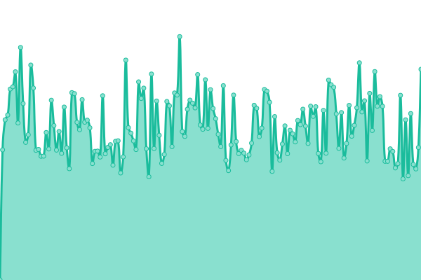
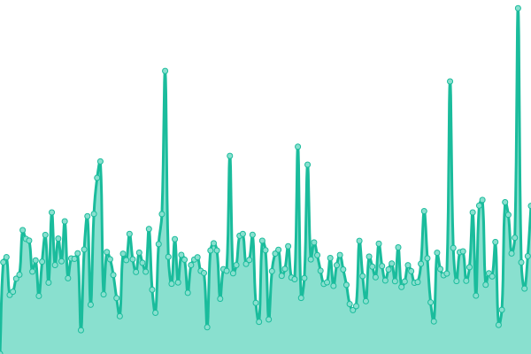

# [📈 Live Status](https://positive-infinity.github.io/api-status): <!--live status--> **🟩 All systems operational**

This repository contains the open-source uptime monitor and status page for [positive-infinity](https://positive-infinity.github.io/api-status), powered by [Upptime](https://github.com/upptime/upptime).

With [Upptime](https://upptime.js.org), you can get your own unlimited and free uptime monitor and status page, powered entirely by a GitHub repository. We use [Issues](https://github.com/positive-infinity/api-status/issues) as incident reports, [Actions](https://github.com/positive-infinity/api-status/actions) as uptime monitors, and [Pages](https://positive-infinity.github.io/api-status) for the status page.

<!--start: status pages-->
<!-- This summary is generated by Upptime (https://github.com/upptime/upptime) -->
<!-- Do not edit this manually, your changes will be overwritten -->
<!-- prettier-ignore -->
| URL | Status | History | Response Time | Uptime |
| --- | ------ | ------- | ------------- | ------ |
|  pi-main | 🟩 Up | [pi-main.yml](https://github.com/positive-infinity/api-status-main/commits/HEAD/history/pi-main.yml) | 

 1378ms
     
 | 

<a href="https://positive-infinity.github.io/api-status-main/history/pi-main">99.51%</a>
    

|  tk | 🟩 Up | [tk.yml](https://github.com/positive-infinity/api-status-main/commits/HEAD/history/tk.yml) | 

 706ms
     
 | 

<a href="https://positive-infinity.github.io/api-status-main/history/tk">99.43%</a>
    

|  ma | 🟩 Up | [ma.yml](https://github.com/positive-infinity/api-status-main/commits/HEAD/history/ma.yml) | 

 675ms
     
 | 

<a href="https://positive-infinity.github.io/api-status-main/history/ma">100.00%</a>
    

|  wiki | 🟩 Up | [wiki.yml](https://github.com/positive-infinity/api-status-main/commits/HEAD/history/wiki.yml) | 

 300ms
     
 | 

<a href="https://positive-infinity.github.io/api-status-main/history/wiki">100.00%</a>
    

<!--end: status pages-->

[**Visit our status website →**](https://positive-infinity.github.io/api-status)

## 📄 License

- Powered by: [Upptime](https://github.com/upptime/upptime)
- Code: [MIT](./LICENSE) © [positive-infinity](https://positive-infinity.github.io/api-status)
- Data in the `./history` directory: [Open Database License](https://opendatacommons.org/licenses/odbl/1-0/)
